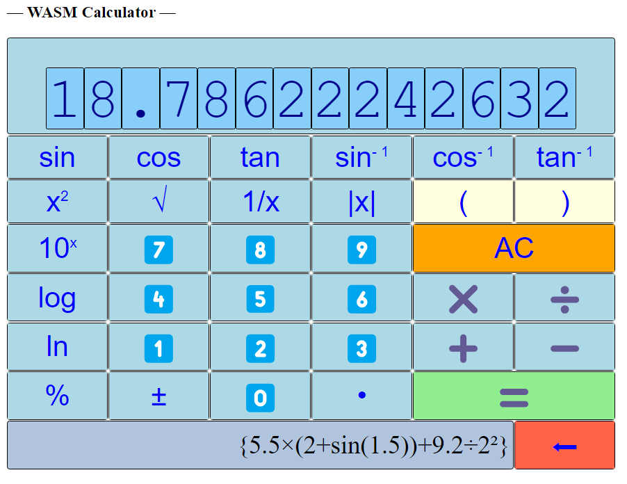

# A Simple WASM Calculator Implemented in Rust Using Leptos, and with DumbCalculator




## Development Environment

Here I will assume program development tools like
* Of cause, the [Rust](https://www.rust-lang.org/tools/install) programming language itself.
* The popular [VSCode](https://code.visualstudio.com/download) program development editor / IDE, with the extension 
  [rust-analyzer](https://marketplace.visualstudio.com/items?itemName=rust-lang.rust-analyzer)
* Preferably the popular source control tool [GIT](https://git-scm.com/downloads).

## Rust Crates Used

* [Leptos](https://leptos.dev/) -- a Rust framework to develop WASM app in Rust
* [DumbCalculator](https://docs.rs/rusty_dumb_tools/0.1.6/rusty_dumb_tools/calculator/struct.DumbCalculator.html) of [rusty_dumb_tools](https://github.com/trevorwslee/rusty_dumb_tools) -- a simple Rust component that acts like a simple physical calculator. 

## Preparation for WASM Development

WASM development in Rust can be enabled with the [Trunk](https://trunkrs.dev/) tool.
Indeed, Trunk is used here, and we install Trunk like

```
cargo install trunk
```

After installing Trunk, we will also need to add the Rust target `wasm32-unknown-unknown`, like
```
rustup target add wasm32-unknown-unknown
```

## Kick-starting `wasm_calculator`

To get kick-started, create a new Rust project `wasm_calculator` like
```
cargo new wasm_calculator
```

Open the just created folder `wasm_calculator` with VSCode like
```
cd wasm_calculator
code .
```

In VSCode, open and edit `Cargo.toml` adding the necessary dependencies, like
```
...
[dependencies]
leptos = { version = "0.6.5", features = ["csr"] }
rusty_dumb_tools = {version = "0.1.7"}
```

Add the Trunk config file `Trunk.toml` with content like
```
[build]
target = "trunk.html"
```

Add `trunk.html`, which is sort of the template for our final output `index.html`
```
<!DOCTYPE html>
<html>
  <head><meta charset="UTF-8"></head>
  <body></body>
</html>
```

Note that without the above mentioned `Trunk.toml` config file, Trunk will in fact look for `index.html` as the template instead.

Our WASM code will be "mounted" to  `<body>` of this `trunk.html`, let's see it working
```
trunk serve --open
```

This will run the Trunk server serving the `trunk.html` merging with whatever WASM code in `main.rs`

The server will keep running, and hot update the page whenever `trunk.html` or `main.rs` changed

Say, change the `<body>` of `trunk.html` to 
```
<body><h3>&mdash; WASM Calculator &mdash;</h3></body>
```

See that the browser page is changed accordingly.

## The basis of `wasm_calculator` 

The initially generated `main.rs` is actually not WASM code to be "mounted" to `<body>`.
To "mount" some simple WASM code (written in Rust), can change `main.rs` like
```
use leptos::*;
fn main() {
    mount_to_body(move || {
        view! {
            <div style="color:red">Hello, World!</div>
        }
    });
}
```

Again, our modification will be hot-deployed, and we should see that
```
<div style="color:red">Hello, World!</div>
```
is "mounted" to `<body>`, after `<h3>&mdash; WASM Calculator &mdash;</h3>`  

Here is some little insights from the above code:
- `mount_to_body` is the function provided by Leptos to "mount" WASM code (written in Rust) to `<body>`
- `mount_to_body` can accept a closure which accepts no argument and returns the result of calling the `view!` macro, which is of cause also provided by Leptos.
- Inside `view!`, we write "HTML" -- like `<div style="color:red">Hello, World!</div>` -- which even looks like plain HTML, is in fact valid Rust code to be pre-processed by the macro `view!`.

In fact, normally, we will be coding our WASM code, in an `App()` function, and "mount" it like
```
use leptos::*;
fn main() {
    mount_to_body(move || view! { <App/> });
}
fn App() -> impl IntoView {
    view! {
        <div style="color:red">Hello, World!</div>
    }
}
``` 

As mentioned above, things inside `view!` will be pre-processed to be transcribed to Rust code in compile time, hence, we should be able to include regular Rust code inside `view!` like
```
fn App() -> impl IntoView {
    let color = "red";
    let who = "World"; 
    view! {
        <div style={format!("color:{}", color)}>Hello, {who}!</div>
    }
}
```
As shown, we can enclose regular Rust code inside `{}` as above `{format!("color:{}", color)}` and `Hello, {who}!`

We can even "nest" `view!` like
```
fn App() -> impl IntoView {
  let color = "red";
  let who = "World"; 
  view! {
    {
      view! {
        <div style={format!("color:{}", color)}>Hello, {who}!</div>
      }
    }
  }
}
```
Why "nest" `view!`? Hopefully, it will become apparent in later sections. 

Let's extract the styling of the `<div>` to live else-where. Indeed, we can put our CSS in `trunk.html` and use it in `App()` like

`trunk.html`
```
<!DOCTYPE html>
<style>
  .test-class {
    color: green;
  }
</style>
...
```

`main.rs`
```
...
fn App() -> impl IntoView {
  let who = "World"; 
  view! {
    {
      view! {
        <div class="test-class">Hello, {who}!</div>
      }
    }
  }
}
```

Now, let's add two buttons to it to make it interactive.

Note that Leptos will render HTML once only -- like the above `App()` will only be called once to generate initial HTML code -- any updates are triggered with "signals", and rendered with closures (more about this later).

Therefore, to make it interactive, not only we will need to add some interactive HTML elements, like `<button>`, we will also need to make use of "signals" as well.

First, let's add two `<button>`s, and be able to log to the browser's console when any of the button is clicked:
```
use leptos::*;
use leptos::logging::log;
use web_sys::MouseEvent;
...
fn App() -> impl IntoView {
  let who = "World"; 
  let on_clicked = |ev: MouseEvent| {
    let value = event_target_value(&ev);
    log!("* clicked value [{}]", value);
  };
  view! {
    {
      view! {
        <div class="test-class">Hello, {who}!</div>
      }
    }
    <button on:click=on_clicked value="1">I am 1</button>
    <button on:click=on_clicked value="2">I am 2</button>
  }
}
```

Notes:
* Two more dependencies
  ```
    use leptos::logging::log;
    use web_sys::MouseEvent;
  ```
* The closure defined by `on_clicked` will be called when any one of the button is clicked
  ```
    <button on:click=on_clicked value="1">I am 1</button>
    <button on:click=on_clicked value="2">I am 2</button>
  ```
  Notice that the two `<button>`s are placed in the same level as the "nested" `view!`
* Each button is associated with a value (e.g. `value="1"`), and when a button is clicked, the associated value is retrieved and printed out to the browser's console 
  ```
    let value = event_target_value(&ev);
    log!("* clicked value [{}]", value);
  ``` 

Now, let's make use of "signal" to trigger update of the `<div>` content

```
fn App() -> impl IntoView {
  let (clicked_value, set_clicked_value) = create_signal(String::from(""));
  let on_clicked = move |ev: MouseEvent| {
    let value = event_target_value(&ev);
    log!("* clicked value [{}]", value);
    set_clicked_value.set(value);
  };
  view! {
    {
      move || view! {
        <div class="test-class"> {
          let value = clicked_value.get();
          format!("Hello, [{}]!", value)
        } </div>
      }
    }
    <button on:click=on_clicked value="1">I am 1</button>
    <button on:click=on_clicked value="2">I am 2</button>
  }
}
```

Notes:
* The "signal" is created like
  ```
    let (clicked_value, set_clicked_value) = create_signal(String::from(""));
  ```
  - such a "signal" is composed of a "getter" `clicked_value` and a "setter" `set_clicked_value`
  - the type of the "signal" is `String`, and the "signal" is initialized to the empty `String`
* The "setter" `set_clicked_value` is called to set new value in the closure defined by `on_click`, which is called when any of the button is clicked
  ```
  let on_clicked = move |ev: MouseEvent| {
    ...
    set_clicked_value.set(value);
  }
  ```
  Notice that the closure captures variables, like `set_clicked_value`,  moved; and this is the requirement of using "signal"
* The "user" of the "signal" is the `<div>` created by the nested `view!`
  ```
      move || view! {
        <div class="test-class"> {
          let value = clicked_value.get();
          format!("Hello, [{}]!", value)
        } </div>
      }
  ```
  Notice:
  - the "nested" `view` is now a "moved" closure, since it is using the "signal" to get the new value set
  - the value set is returned by calling `clicked_value.get()`
  - by using the "signal", Leptos knows that the closure need be called again to update the content of the nested `view!` when the "signal" is updated
* Here is what will happen when a button is clicked
  - the closure `on_click` gets called
  - the "signal" gets updated when `set_clicked_value` is called
  - the closure of the "nested" `view!` gets called when the "signal" is updated, which will update the `<div>` generated by the "nested" `view!`    


Let's change the buttons to ones that simulate the key presses for `1 + 2 =`

```
    <button on:click=on_clicked value="1">1</button>
    <button on:click=on_clicked value="+">+</button>
    <button on:click=on_clicked value="2">2</button>
    <button on:click=on_clicked value="=">=</button>
```

And also add `DumbCalculator` into the picture
```
...
use std::cell::RefCell;
use rusty_dumb_tools::calculator::*;
...
fn App() -> impl IntoView {
  let calculator_ref = RefCell::new(DumbCalculator::new());
  let (clicked_value, set_clicked_value) = create_signal(String::from(""));
  let on_clicked = move |ev: MouseEvent| {
    let value = event_target_value(&ev);
    log!("* clicked value [{}]", value);
    set_clicked_value.set(value);
  };
  view! {
    {
      move || view! {
        <div class="test-class"> {
          let mut calculator = calculator_ref.borrow_mut();
          let value = clicked_value.get();
          if !value.is_empty() {
            calculator.push(value.as_str()).unwrap();
          }
          let result_value = calculator.get_display_sized(10);
          format!("[{}]", result_value)
        } </div>
      }
    }
    <button on:click=on_clicked value="1">1</button>
    <button on:click=on_clicked value="+">+</button>
    <button on:click=on_clicked value="2">2</button>
    <button on:click=on_clicked value="=">=</button>
  }
}
```
Notes:
* An instance of `DumbCalculator` is created and stored in a `RefCell`, and assigned to `calculator_ref`; note that even `calculator_ref` is immutable, the instance of `DumbCalculator` can be retrieved mutable 
  ```
    let calculator_ref = RefCell::new(DumbCalculator::new());
  ```
  Note that since `App()` will only be called one, only a single instance of `DumbCalculator` will ever be created, unless the browser page is refreshed.
* The "nested" `view!` code for the `<div>` is changed to something like
  ```
    <div class="test-class"> {
      let mut calculator = calculator_ref.borrow_mut();
      let value = clicked_value.get();
      if !value.is_empty() {
        calculator.push(value.as_str()).unwrap();
      }
      let result_value = calculator.get_display_sized(10);
      format!("[{}]", result_value)
    } </div>
  ```  
  - The instance of `DumbCalculator` is "borrowed" mutable
    ```
      let mut calculator = calculator_ref.borrow_mut();
    ```
  - The button value, which is supposed to simulate calculator key press, is pushed to the `DumbCalculator` like
    ```
      calculator.push(value.as_str()).unwrap();
    ```
  - What the calculator display should look like is rendered in the content of the `<div>`
    ```
      let result_value = calculator.get_display_sized(10);
      format!("[{}]!", result_value)
    ```       

Now, let's add two buttons for "AC" (*all cancel*) as well as "⬅" (*undo*)

```
fn App() -> impl IntoView {
  let calculator_ref = RefCell::new(DumbCalculator::new());
  let (clicked_value, set_clicked_value) = create_signal(String::from(""));
  let on_clicked = move |ev: MouseEvent| {
    let value = event_target_value(&ev);
    log!("* clicked value [{}]", value);
    set_clicked_value.set(value);
  };
  view! {
    {
      move || view! {
        <div class="test-class"> {
          let mut calculator = calculator_ref.borrow_mut();
          let value = clicked_value.get();
          if value == "ac" {
            calculator.reset();
          } else if value == "<" {
            calculator.undo();
          } else if !value.is_empty() {
            calculator.push(value.as_str()).unwrap();
          }
          let result_value = calculator.get_display_sized(10);
          format!("[{}]", result_value)
        } </div>
      }
    }
    <button on:click=on_clicked value="1">1</button>
    <button on:click=on_clicked value="+">+</button>
    <button on:click=on_clicked value="2">2</button>
    <button on:click=on_clicked value="=">=</button>
    <div>
      <button on:click=on_clicked value="ac">AC</button>
      <button on:click=on_clicked value="<">{"⬅"}</button>
    </div>
  }
}
```

Notes:
* The two additional buttons are added below the `1 + 2 =` buttons like
  ```
    <div>
      <button on:click=on_clicked value="ac">AC</button>
      <button on:click=on_clicked value="<">{"⬅"}</button>
    </div>
  ``` 
* Clicking of the two buttons are handled like
  ```
    let value = clicked_value.get();
    if value == "ac" {
      calculator.reset();
    } else if value == "<" {
      calculator.undo();
    } else if !value.is_empty() {
      calculator.push(value.as_str()).unwrap();
    }
  ```  

We are getting closer and closer. Let's add to the code the capability of showing the history of the calculator.

For this, we will be using another `history` "signal".
```
fn App() -> impl IntoView {
  let calculator_ref = RefCell::new(DumbCalculator::new());
  let (clicked_value, set_clicked_value) = create_signal(String::from(""));
  let (history, set_history) = create_signal(String::from(""));
  let on_clicked = move |ev: MouseEvent| {
    let value = event_target_value(&ev);
    log!("* clicked value [{}]", value);
    set_clicked_value.set(value);
  };
  view! {
    {
      move || view! {
        <div class="test-class"> {
          let mut calculator = calculator_ref.borrow_mut();
          let value = clicked_value.get();
          if value == "ac" {
            calculator.reset();
          } else if value == "<" {
            calculator.undo();
          } else if !value.is_empty() {
            calculator.push(value.as_str()).unwrap();
          }
          let history = calculator.get_history_string(true);
          match &history {
            Some(hist) => set_history.set(hist.to_string()),
            None => set_history.set("".to_string()),  
          }
          let result_value = calculator.get_display_sized(10);
          format!("[{}]", result_value)
        } </div>
      }
    }
    <button on:click=on_clicked value="1">1</button>
    <button on:click=on_clicked value="+">+</button>
    <button on:click=on_clicked value="2">2</button>
    <button on:click=on_clicked value="=">=</button>
    <div>
      <button on:click=on_clicked value="ac">AC</button>
      <button on:click=on_clicked value="<">{"⬅"}</button>
      {move || view! {
        <span> { history.get() } </span>
      }}
    </div>
  }
}
```

Notes:
* The `history` "signal" is added like
  ```
    let (history, set_history) = create_signal(String::from(""));
  ```
* The `history` if set after pushing value to the calculator
  ```
    let history = calculator.get_history_string(true);
    match &history {
      Some(hist) => set_history.set(hist.to_string()),
      None => set_history.set("".to_string()),  
    }
  ```
* The updated `history` is displayed next to the "⬅" button 
  ```
    {move || view! {
      <span> { history.get() } </span>
    }}
  ``` 


## Finally

Finally, let's add all the whistles and bells and finish off our calculator ... 

Simply ... please replace the corresponding file as listed here:

- `trunk.html` -- https://github.com/trevorwslee/wasm_calculator/blob/master/trunk.html
- `main.rs` -- https://github.com/trevorwslee/wasm_calculator/blob/master/src/main.rs


## Manually Deploy to GitHub Page 

Now that we have the final result WASM calculator, we may want to deployed it to GitHub Pages.

Assuming a GitHub account, say like mine -- `trevorwslee`, I can easily post some static pages to my GitHub Pages -- `https://trevorwslee.github.io/`

What I needed is a GitHub repository with the "same" name `trevorwslee.github.io` -- https://github.com/trevorwslee/trevorwslee.github.io

In order for GitHub Pages to host our WASM Calculator app
* With Trunk, build *release* version specifying the context to use in GitHub Pages, like mine
  - The context is `WASMCalculator`
  - Then the URL to the WASM app is https://trevorwslee.github.io/WASMCalculator/
* To build such *release*, run Trunk like
  ```
  trunk build --release --public-url "WASMCalculator"
  ```
* After building the *release* with Trunk, the `dist` folder will contain the files
  - `index.html`
  - `wasm_calculator-XXX.wasm`
  - `wasm_calculator-XXX.js`
  to be checked in to `WASMCalculator` folder of the GitHub Pages repository, like mine -- https://github.com/trevorwslee/trevorwslee.github.io/tree/main/WASMCalculator
* After a few moments, the WASM Calculator should be ready to try out -- https://trevorwslee.github.io/WASMCalculator/  


##  Enjoy!

> Peace be with you!
> May God bless you!
> Jesus loves you!
> Amazing Grace!

